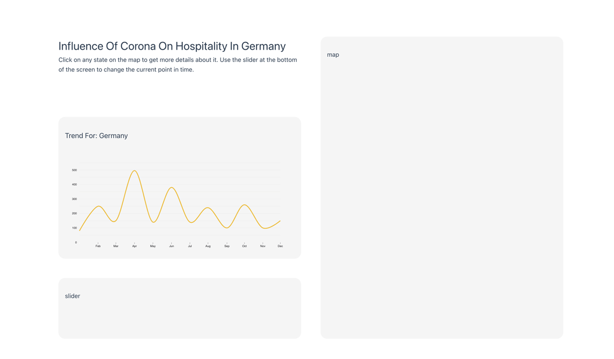

# Team 20

## Setting up CI/CD pipelines in lrz gitlab
1. Follow this tutorial: https://www.dev-eth0.de/2021/03/09/autoscaling-gitlab-runner-instances-on-google-cloud-platform
2. Add firewall rule for TCP/22: https://gitlab.com/gitlab-org/ci-cd/docker-machine/-/issues/47
3. Make sure that the ServiceAccount has admin rights: https://cloud.google.com/iam/docs/granting-changing-revoking-access
```bash
gcloud projects add-iam-policy-binding infovizteam20     --member=serviceAccount:serviceaccountteam20@infovizteam20.iam.gserviceaccount.com --role=roles/compute.admin
```
```toml
concurrent = 2
check_interval = 0
shutdown_timeout = 0

[session_server]
  session_timeout = 1800

[[runners]]
  name = "gitlab-runner-gce"
  url = "https://gitlab.lrz.de/"
  id = 25917
  token = "XiiaQtGMdk-TZ9rqobw5"
  token_obtained_at = 2022-11-25T11:49:46Z
  token_expires_at = 0001-01-01T00:00:00Z
  executor = "docker+machine"
  [runners.custom_build_dir]
  [runners.docker]
    tls_verify = false
    image = "alpine:latest"
    privileged = false
    disable_entrypoint_overwrite = false
    oom_kill_disable = false
    disable_cache = false
    volumes = ["/cache"]
    shm_size = 0
  [runners.machine]
    IdleCount = 0
    IdleTime = 30
    MachineDriver = "google"
    MachineName = "auto-scale-runner-%s"
    MachineOptions = [
      "google-project=infovizteam20",
      # Depending on your requirements, choose another instance
      "google-machine-type=e2-highcpu-4",
      # When running the forked docker-machine, you should use cos-stable
      "google-machine-image=cos-cloud/global/images/family/cos-stable",
      # Otherwise you can use debian-10
#      "google-machine-image=debian-cloud/global/images/family/debian-10",
      "google-preemptible=true",
      "google-zone=europe-west3-c",
      "engine-registry-mirror=https://mirror.gcr.io",
      "google-use-internal-ip=true",
    ]
  [runners.cache]
    Type = "gcs"
    Path = "gitlab-runner"
    Shared = false

    [runners.cache.gcs]
      BucketName = "team20bucket"
      CredentialsFile = "/etc/gitlab-runner/client_secret.json"
```


## Getting started

To make it easy for you to get started with GitLab, here's a list of recommended next steps.

Already a pro? Just edit this README.md and make it your own. Want to make it easy? [Use the template at the bottom](#editing-this-readme)!

## Add your files

- [ ] [Create](https://docs.gitlab.com/ee/user/project/repository/web_editor.html#create-a-file) or [upload](https://docs.gitlab.com/ee/user/project/repository/web_editor.html#upload-a-file) files
- [ ] [Add files using the command line](https://docs.gitlab.com/ee/gitlab-basics/add-file.html#add-a-file-using-the-command-line) or push an existing Git repository with the following command:

```
cd existing_repo
git remote add origin https://gitlab.lrz.de/iv2223-projects/team-20.git
git branch -M main
git push -uf origin main
```

## Integrate with your tools

- [ ] [Set up project integrations](https://gitlab.lrz.de/iv2223-projects/team-20/-/settings/integrations)

## Collaborate with your team

- [ ] [Invite team members and collaborators](https://docs.gitlab.com/ee/user/project/members/)
- [ ] [Create a new merge request](https://docs.gitlab.com/ee/user/project/merge_requests/creating_merge_requests.html)
- [ ] [Automatically close issues from merge requests](https://docs.gitlab.com/ee/user/project/issues/managing_issues.html#closing-issues-automatically)
- [ ] [Enable merge request approvals](https://docs.gitlab.com/ee/user/project/merge_requests/approvals/)
- [ ] [Automatically merge when pipeline succeeds](https://docs.gitlab.com/ee/user/project/merge_requests/merge_when_pipeline_succeeds.html)

## Test and Deploy

Use the built-in continuous integration in GitLab.

- [ ] [Get started with GitLab CI/CD](https://docs.gitlab.com/ee/ci/quick_start/index.html)
- [ ] [Analyze your code for known vulnerabilities with Static Application Security Testing(SAST)](https://docs.gitlab.com/ee/user/application_security/sast/)
- [ ] [Deploy to Kubernetes, Amazon EC2, or Amazon ECS using Auto Deploy](https://docs.gitlab.com/ee/topics/autodevops/requirements.html)
- [ ] [Use pull-based deployments for improved Kubernetes management](https://docs.gitlab.com/ee/user/clusters/agent/)
- [ ] [Set up protected environments](https://docs.gitlab.com/ee/ci/environments/protected_environments.html)

***

# Editing this README

When you're ready to make this README your own, just edit this file and use the handy template below (or feel free to structure it however you want - this is just a starting point!). Thank you to [makeareadme.com](https://www.makeareadme.com/) for this template.

## Name
Influence of Corona on Hospitality in Germany

## Progress
We are currently building the basic graphical setup. The data are not yet integrate but we are able to show a line chart.

## Next steps
- Integrate Data to display hospitality
- Create map (in progress)
- Create slider

## Visualization

